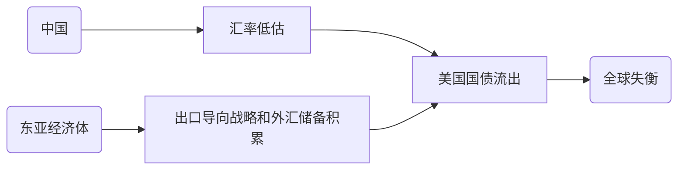
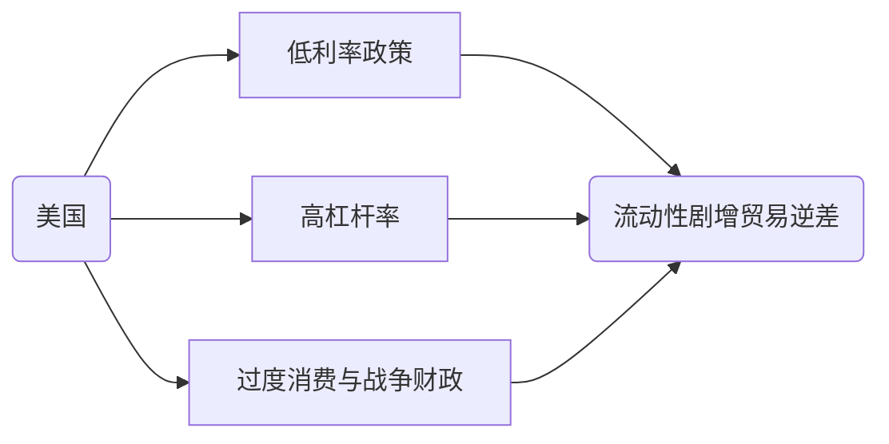

# 《从西潮到东风》#书籍

## 一、概论

### 1. 2008全球经济危机的形成因素

1. 全球失衡源自东亚和中国？



2. 东亚反驳
   1. `出口导向战略`已经实施半个世纪，但最近贸易顺差才大幅飙升
   2. 除美国外所有国家几乎都出现贸易顺差飙升



3. 中国反驳
   1. 中国在2005年后才出现巨额贸易顺差
   2. 双轨制-->高份额企业储蓄-->是高速发展和低消费率的原因

### 2. 走向复苏的共赢之路

1. 结构性改革的挑战
   1. 短期紧缩性：市场迭代-->经济增长放缓+失业人口增加
   2. 抵消方法：通过货币贬值刺激出口，
      1. 对非储备货币发行/无独立政策/无法公共货币债务化的国家不便实行
      2. 无对应自主权的南欧国家却又迫切需要结构性改革
2. 超越凯恩斯主义
   1. 理论：基础设施全面投资-->创造需求
   2. 实现：发达国家应当对发展中国家进行帮助

### 3. 落后国家如何实现追赶

> 雁行模式与领头龙模式

1. 中等收入陷阱
2. 发展理论的缺陷
3. 比较优势的工业化

<div STYLE="page-break-after: always;"></div>

## 二、2008年世界危机的原因

### 1. 危机脉络：企业-->国内-->国外传导机制

1. 爆发节点：抵押贷款违约-->雷曼兄弟与银行机构破产
2. 国内扩散
   1. 金融体系：**信用危机**-->流动性危机和挤兑现象
   2. 实业部门：**消费信心危机**-->经济增长与就业萎靡
3. 国际扩散
   1. 货币市场：破产企业短期**债务失效**-->金融市场资金逃离-->流动性危机和挤兑现象
   2. 贸易：**信用证与商业票据失效**-->全球贸易停滞
   3. 汇款：工人**失业**-->*局部*汇款锐减

### 2. 危机起因：东亚/美国主动

1. 假说一：全球失衡问题
   1. 内容：中国和东亚的三类政策-->全球储蓄过剩
      > 三类政策：**出口导向型**经济增长战略、用于**自保**的外汇储备积累政策、**中国汇率**政策
   2. 反驳
      1. 出口导向型经济增长战略：**时间**和**内容**不匹配
         1. 时间：出口导向型战略自1960s已经开始
         2. 内容：可持续的出口导向战略既面向出口，也增加进口，依靠紧密一体化
      2. 自保动机：**动机**不能完全解释
         1. 德国/日本：完全可兑换货币-->不需要自保
         2. 中国：外汇储备过多-->超出自保需要
      3. 中国汇率政策：**测度**和**影响**不能完全涵盖
         1. 低估测度？
            1. 购买力平价法：发展中国家的劳动密集型产品低价，发达国家的资本密集型产品低价。不能通过比例直接平价。
            2. 基本均衡汇率法：经常账户平衡与基本价值平衡不能等价。
         2. 低估影响？
            1. 正向：**汇率对经常账户机制**不明确，**储蓄-投资-汇率关系**中汇率是二级变量
            2. 反向：时间、空间上的错位
      4. 利率：利率与经常账户(产出-消费-储蓄-进出口)关系不明确
2. **假说二：美国政策问题**
   1. 内容：美国低利率政策+金融结构宽松风险-->泡沫财富效应过度消费+战争债务+减税政策-->经常账户赤字

      - 经济学理论的重要原则：归纳性(揭示普遍现实)、检验性(能够得到验证)、应用性(能够指导现实)

      - 供给与需求的区别：
        - 对时间：供给为长期决定性，需求为短期优化性
        - 对方向：供给为有效率建设，需求为无效率干预
        - 对主体：供给包括实业/政府/社会组织等多层次体系

   2. 解释

      ```mermaid
      graph LR
      A(宽松货币政策和低利率)-->B[顶层金融监管放松]-->C[底层消费扩张/贷款增加]-->D[国内:投资金融市场/房地产泡沫]-->过度贷款消费-->E(经常账户失衡)
      D-->|财富效应|D
      C-->国际:投资贸易逆差-->E
      F(阿富汗与伊拉克战争/减税行动)-->E
      ```

      > 房地产泡沫：通过住房的`权益贷款`+`抵押贷款`再融资套现，建立在金融体系和消费市场信用基础上

### 3. 危机透镜：金融监管放松和房地产泡沫

> 诚然，总体上，`量宽政策`/`战争减税`导致了经常账户顺差，`量宽政策`的机制落在`顶层过弱监管`与`底层国内外投资`的共同发力。但局部上，金融监管放松如何引致扩张性崩溃?

1. 挑战：新型金融工具
   1. 影子银行
2. 应对：格林斯潘对策
3. 次级抵押贷款市场的扩张
