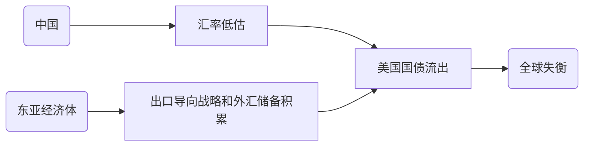
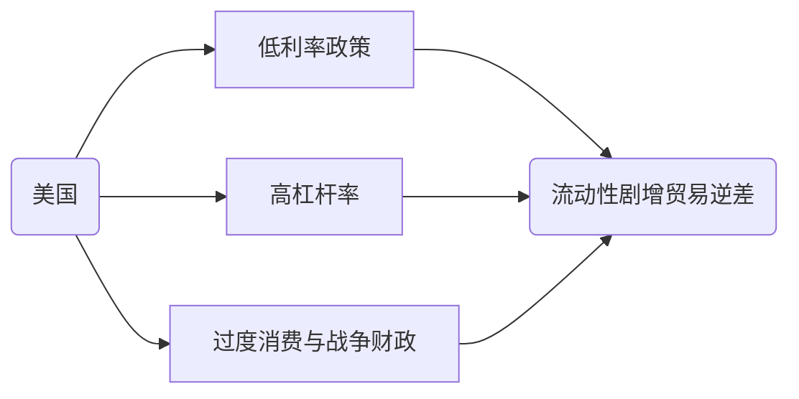
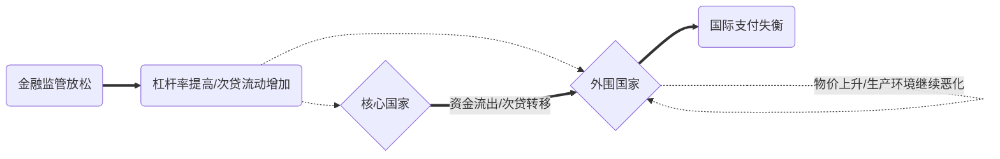
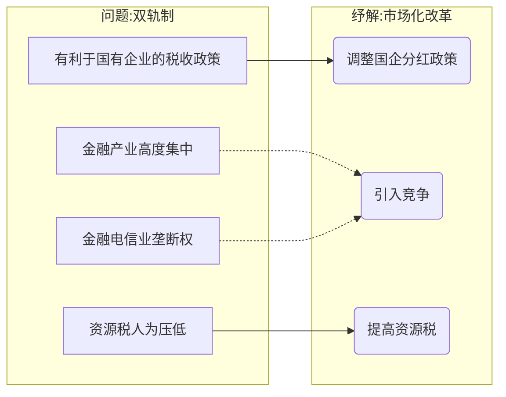

# 《从西潮到东风》#书籍

## 一、概论

### 1. 2008全球经济危机的形成因素

1. 全球失衡源自东亚和中国？



2. 东亚反驳
   1. `出口导向战略`已经实施半个世纪，但最近贸易顺差才大幅飙升
   2. 除美国外所有国家几乎都出现贸易顺差飙升



3. 中国反驳
   1. 中国在2005年后才出现巨额贸易顺差
   2. 双轨制-->高份额企业储蓄-->是高速发展和低消费率的原因

### 2. 走向复苏的共赢之路

1. 结构性改革的挑战
   1. 短期紧缩性：市场迭代-->经济增长放缓+失业人口增加
   2. 抵消方法：通过货币贬值刺激出口，
      1. 对非储备货币发行/无独立政策/无法公共货币债务化的国家不便实行
      2. 无对应自主权的南欧国家却又迫切需要结构性改革
2. 超越凯恩斯主义
   1. 理论：基础设施全面投资-->创造需求
   2. 实现：发达国家应当对发展中国家进行帮助

### 3. 落后国家如何实现追赶

> 雁行模式与领头龙模式

1. 中等收入陷阱
2. 发展理论的缺陷
3. 比较优势的工业化

<div STYLE="page-break-after: always;"></div>

## 二、2008年世界危机的原因

### 1. 危机脉络：企业-->国内-->国外传导机制

1. 爆发节点：抵押贷款违约-->雷曼兄弟与银行机构破产
2. 国内扩散
   1. 金融体系：**信用危机**-->流动性危机和挤兑现象
   2. 实业部门：**消费信心危机**-->经济增长与就业萎靡
3. 国际扩散
   1. 货币市场：破产企业短期**债务失效**-->金融市场资金逃离-->流动性危机和挤兑现象
   2. 贸易：**信用证与商业票据失效**-->全球贸易停滞
   3. 汇款：工人**失业**-->*局部*汇款锐减

### 2. 危机起因：东亚/美国主动

1. 假说一：全球失衡问题
   1. 内容：中国和东亚的三类政策-->全球储蓄过剩
      > 三类政策：**出口导向型**经济增长战略、用于**自保**的外汇储备积累政策、**中国汇率**政策
   2. 反驳
      1. 出口导向型经济增长战略：**时间**和**内容**不匹配
         1. 时间：出口导向型战略自1960s已经开始
         2. 内容：可持续的出口导向战略既面向出口，也增加进口，依靠紧密一体化
      2. 自保动机：**动机**不能完全解释
         1. 德国/日本：完全可兑换货币-->不需要自保
         2. 中国：外汇储备过多-->超出自保需要
      3. 中国汇率政策：**测度**和**影响**不能完全涵盖
         1. 低估测度？
            1. 购买力平价法：发展中国家的劳动密集型产品低价，发达国家的资本密集型产品低价。不能通过比例直接平价。
            2. 基本均衡汇率法：经常账户平衡与基本价值平衡不能等价。
         2. 低估影响？
            1. 正向：**汇率对经常账户机制**不明确，**储蓄-投资-汇率关系**中汇率是二级变量
            2. 反向：时间、空间上的错位
      4. 利率：利率与经常账户(产出-消费-储蓄-进出口)关系不明确
2. **假说二：美国政策问题**
   1. 内容：美国低利率政策+金融结构宽松风险-->泡沫财富效应过度消费+战争债务+减税政策-->经常账户赤字

      - 经济学理论的重要原则：归纳性(揭示普遍现实)、检验性(能够得到验证)、应用性(能够指导现实)

      - 供给与需求的区别：
        - 对时间：供给为长期决定性，需求为短期优化性
        - 对方向：供给为有效率建设，需求为无效率干预
        - 对主体：供给包括实业/政府/社会组织等多层次体系

   2. 解释

      ```mermaid
      flowchart LR

      subgraph H[国内政治经济环境]
         B[政府:宽松货币政策/金融监管放松]==>C[企业:消费扩张/次贷增加/新型金融工具]
      end

      H==>D(国内:投资金融市场/房地产泡沫)==>过度贷款消费==>E(经常账户失衡)
      D-.->|财富效应|D

      H-->A(国际:投资贸易逆差)-->E
      A-.->|资金转移|D

      F(国内:阿富汗与伊拉克战争/减税行动)-->E
      ```

      > 房地产泡沫：通过住房的`权益贷款`+`抵押贷款`再融资套现，建立在金融体系和消费市场信用基础上

### 3. 危机主体：美国金融监管放松和房地产泡沫

> 诚然，总体上，`量宽政策`/`战争减税`导致了经常账户顺差，`量宽政策`的机制落在`顶层过弱监管`与`底层国内外投资`的共同发力。
> 但局部上，金融监管放松如何引致扩张性崩溃?

1. 未知挑战：新型金融工具
   1. 影子银行：未纳入银行监管体系的银行业务
   2. 次级抵押贷款：贷款机构向信用/预期较差借款人提供的贷款
   3. 道德风险：合同中一方面临**对方行为可能损害本方利益**的风险
2. 无力应对：格林斯潘对策
   1. 美联储：格林斯潘规避事前干预、强调事后补救
   2. 行政政府：鼓励次贷-->帮助低收入群体住房自有化
      1. 企业：听从政府+受次贷高利率吸引
   3. 立法国会：对监管体系拨款
      1. 监管体系：听从国会-->放宽监管
3. 国内外扩散：次级抵押贷款市场的扩张
   1. 国内：强推动弱监管的政府+顺从趋利的企业+金融游说活动推动-->次贷/房地产市场泡沫
   2. 国际：美国资金枯竭+世界各国贸易顺差-->经常账户失衡-->流动性危机与崩溃

### 4. 隐形危机梳理：欧洲的问题

> 根本上，美国与欧洲的危机都来源于需求过剩和供给不足。
> 对美国，政府放松监管和企业推进次贷+美国制造业不景气-->导致了经常账户逆差和流动性危机。
> 对欧洲，核心国家提高杠杆率，导致了弱势国家过度消费+弱势国家产品竞争力不足-->次贷发展/房地产泡沫崩溃。

1. 金融监管放松和一体化



### 5. 危机客体：中国外汇储备的增长

1. 国内



2. 国际：劳动密集型产业从东亚其他国家转移到中国

### 6. 走向复苏的共赢之路

> 受冲击国家的复兴有两条路：其一为结构性改革提升竞争力，从而长期稳定经常账户和金融市场；其二为货币贬值刺激出口，从而短期平衡进出口。

$$
\begin{matrix}
   需求：&AE=C+I+G+NX \\
   供给：&Y=C+S+T \\
\end{matrix}
$$

1. 优点
   1. 对**发达经济体**
      1. 乘数扩大需求-->减少逆差
      2. 增加就业岗位-->缩小阶级差距
   2. 对**发展中国家**
      1. 对基础设施需求高：长期融资困难
      2. 驱动经济发展
      3. 改善生活水平
2. 重点
   1. 正确识别项目：发展效益高
   2. 填补发展中国家资金缺口
      | 来源 | 手段                                   |
      | ---- | -------------------------------------- |
      | 国内 | 税收支持/国内储蓄/公私合作             |
      | 国际 | 国际金融市场/传统援助/非传统双边援助国 |
3. 全球计划设置
   1. 涵盖**发达国家扩张需求**和**发展中国家基础设施**的需要
   2. 集中于突破制约增长的瓶颈/能够实现盈利的项目
   3. 项目资金应当来自外汇发行国/外汇储备国/国内公共资金

<div STYLE="page-break-after: always;"></div>

## 三、落后国如何追赶——雁行模式/领头龙模式

> 旧发展理论旨在通过发达国家范式指导发展中国家发展；
> 新结构经济学旨在关注发展中国家的比较优势/后发优势。

### 1. 分化与结构性变化

> [健康经济学](https://d.docs.live.net/b59b173326809f6b/%E5%A4%A7%E4%B8%89%E4%B8%8A/%E5%AE%8F%E7%BB%8F%E5%81%A5/%E5%AE%8F%E7%BB%8F%E5%81%A5-%E7%AC%94%E8%AE%B0.docx)内容：健康与经济的趋势区别？
1. 达尔文“生物竞争假说”：指出了经济发展需要可持续结构变迁，但国家经济不总是自然选择和零和博弈
2. 成功：领跑者-追随者研究
   1. 库茨涅兹：分异曲线、**经济/社会/生产**结构变迁特征（短时期局限）
   2. 发展阶段理论：**资本累积率**、**产业结构领先企业**能够促进发展
   3. 亚历山大理论：资本累积并非必要，**技术**和**制度**才是决定因素（西方局部空间局限）
   4. **雁行模式**
      1. 分工维度：产业内、产业间、国际间
      2. 普遍模式：国际劳动分工的次序替代
         > 思考：日本失去的二十年，“雁行模式”失效了吗？
3. 失败：拉美/非洲转型失败的反思
   1. 总体数据：结构变迁对劳动生产率的影响程度-国家增长速度 两者相关
   2. 局部案例：人口增加+农业生产率仍然落后-->产业结构滞后/经济单一化

### 2. 结构变迁的成败总结

