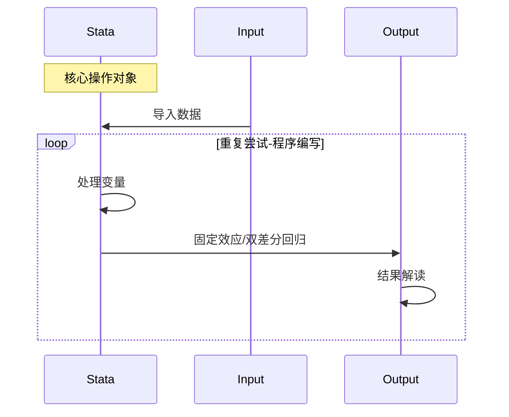

# Arcgis_stata基本内容介绍 #笔记

## 一、Arcgis笔记

### 1. 坐标系

1. 地理坐标系：体现为3D地球表面，**距离**表现为经纬度

   > 总存在：是数据的基本属性

2. 投影坐标系：体现为2D投影平面，**距离**表现为实际距离

   > 二级产物：是`地理坐标系`通过`一定规则`投影的产物

### 2. 投影转换

1. 定义投影/数据属性更改：修改源数据

2. 图层属性修改：修改所见属性

3. 属性继承：往后图层继承第一次图层**坐标系信息**

   > 不同数据坐标系需要统一，通过`Data_management/定义投影`
   > 

### 3. 基准面

> `不规则椭球`到`规则球体`的转化

## 二、stata笔记

> 基础脉络梳理

