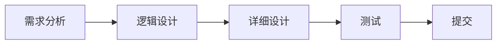
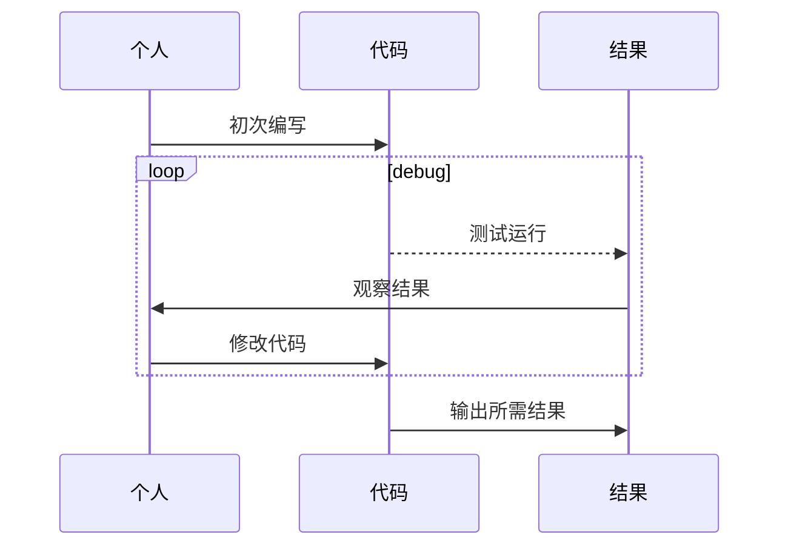

# 基本内容

## 一、开始

1. 传统软件工程思维
   

```mermaid
graph LR
需求分析-->逻辑设计-->详细设计-->测试-->提交
```

2. 现代算法思维
   

```mermaid
sequenceDiagram
个人->>代码:初次编写
loop debug
    代码-->>结果:测试运行
    结果->>个人:观察结果
    个人->>代码:修改代码
end
代码->>结果:输出所需结果
```

3. 

## 二、文本分析实战

## 三、对话机器人

## 四、视觉识别

## 五、强化学习实践

## 六、预测与推荐

