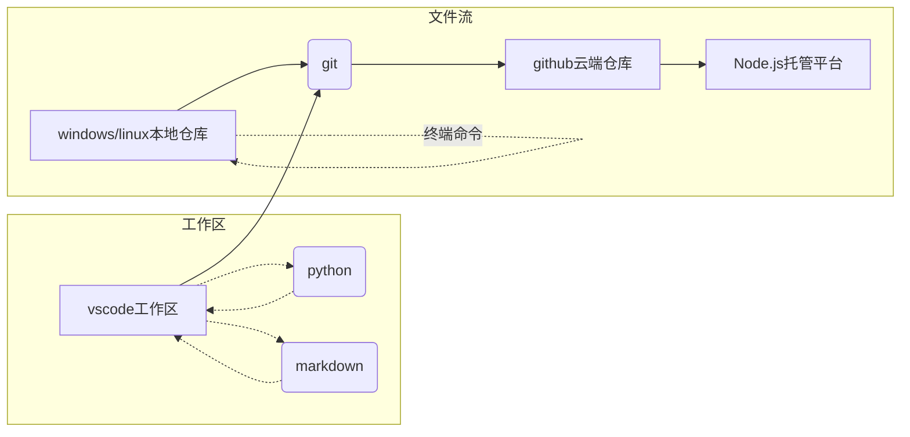

# 代码学习的教程基础

## 一、学习框架

## 二、Python教程

> 当然如果你不想这样学，这里当然也有[教材电子书](https://pan.baidu.com/s/1IpR_hyZYa_xqb_Kl1RreXg)

1. [基础·环境搭建](https://zhuanlan.zhihu.com/p/404793094)：推荐使用`vscode`+`miniconda`（能够创建虚拟环境）
2. [基础·语法教程](https://www.runoob.com/python3/python3-tutorial.html)：python3的基本教程
3. [基础·函数库](https://www.runoob.com/python3/python3-built-in-functions.html)：python3的核心函数，可以自行尝试学习
4. [进阶·git同步](https://www.runoob.com/git/git-tutorial.html)：包括`工作区`、`传递命令`的内容方法。可以在vscode-terminal中开启，将代码同步到github
5. [进阶·windows/linux终端命令](终端命令.md)：掌握windows terminal索引方法和基础函数
6. [进阶·方法学习与问题检索](https://www.csdn.net/)：推荐CSDN，github上多为大型项目（可以经常下下来玩但是学不太方便）

> 可以在`vscode-jupyter`模块中进行学习，但这里还是推荐一般`vscode-*.py`脚本即可

## 三、Markdown教程

1. [基本·语法教程](https://markdown.com.cn/basic-syntax/)：最基础的`Daring Fireball`标准语法，非常简单
2. [基本·vscode环境搭建](https://zhuanlan.zhihu.com/p/366596107)：包含配置、插件、发布
3. [进阶·javascript环境搭建](https://docsify.js.org/#/zh-cn/)：能够帮助你使用免费域名搭建自己的个人博客，这里举较为简单/美观的`docsify`为例
