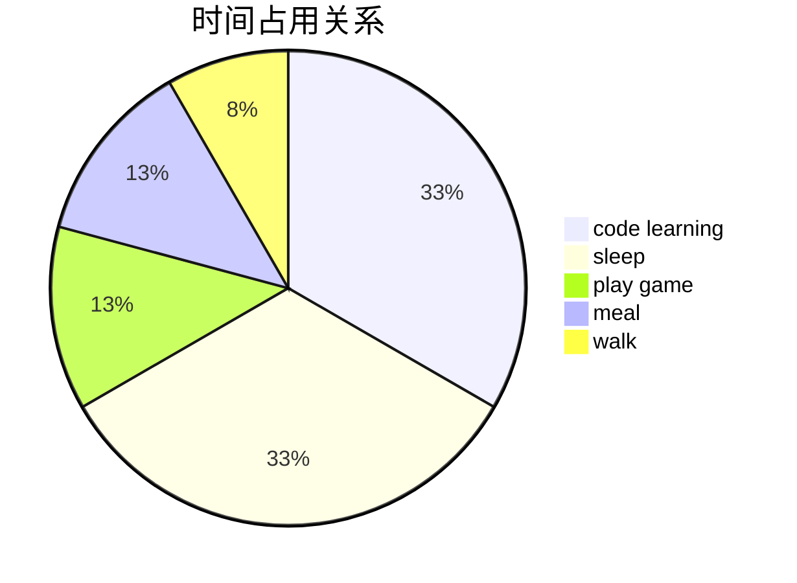

# mermaid使用 #笔记
- [mermaid使用 #笔记](#mermaid使用-笔记)
  - [一、序列图sequenceDiagram](#一序列图sequencediagram)
    - [1. 关系](#1-关系)
    - [2. 标记](#2-标记)
  - [二、流程图graph](#二流程图graph)
    - [1. 线关系](#1-线关系)
    - [2. 面关系](#2-面关系)
  - [三、饼图pie](#三饼图pie)
    - [1. 主体：`name: num`](#1-主体name-num)
    - [2. 标记：`title`](#2-标记title)

## 一、序列图sequenceDiagram
### 1. 关系
1. 线方向：`->>`
2. 线形态：`-.->>`
### 2. 标记
1. 线标记：`A-->B: note`
2. 激活标记：`+/-` `activate/deactivate`
3. 注释标记：`note right of A/over A:`
4. 题目标记：`title`
    ```mermaid
    sequenceDiagram
        title bad
        Alice->>+John: Hello John, how are you?
        loop Healthcheck
            John->>-John: Fight against hypochondria
        end
        Note right of John: Rational thoughts!
    ```

## 二、流程图graph
### 1. 线关系
1. 线方向：`A --> B & D -->C`
2. 线形态：`-.->`

    
3. 线注释：`--text-->`
### 2. 面关系
1. 子图划分：`subgraph graphname \\ end`
2. 子图交联：`graphname1 --> graphname2`
3. 子图嵌套
    ```mermaid
    graph TD
        subgraph one
            A-->|text1|B & C==>|text2|D
        end
        subgraph two
            E{begin}-.->F(end)
        end
    ```

## 三、饼图pie
### 1. 主体：`name: num`
### 2. 标记：`title`

