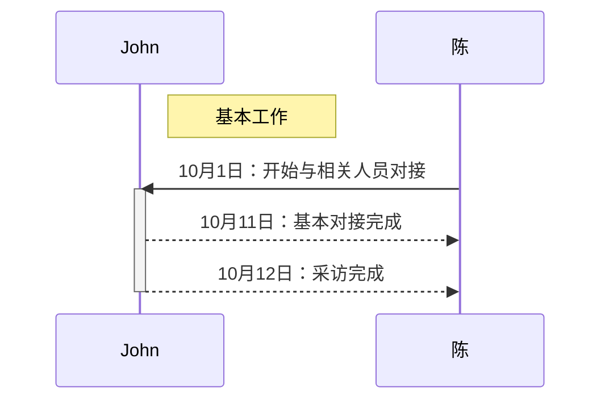
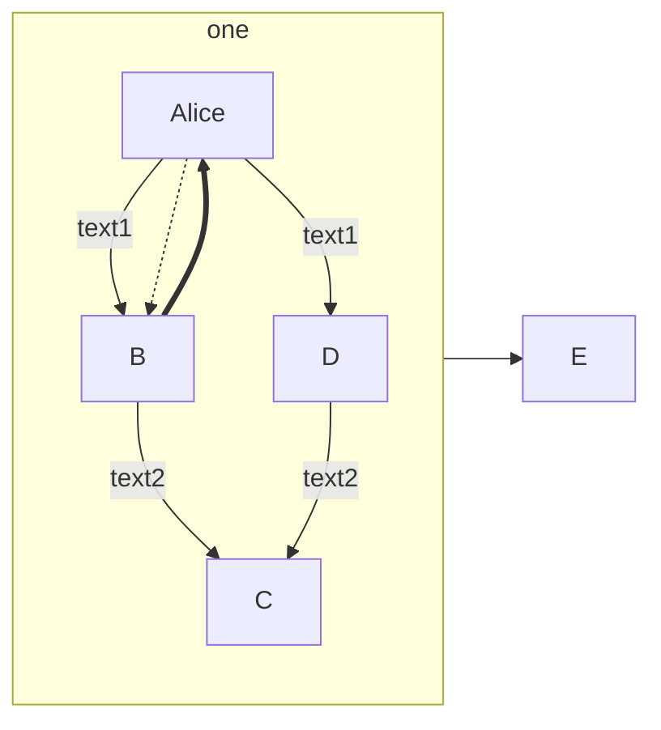

# MPE-Mermaid基础介绍
---
<!-- @import "[TOC]" {cmd="toc" depthFrom=1 depthTo=6 orderedList=false} -->

<!-- code_chunk_output -->

- [MPE-Mermaid基础介绍](#mpe-mermaid基础介绍)
  - [一、序列图](#一-序列图)
    - [1. 关系](#1-关系)
    - [2. 标记](#2-标记)
  - [二、流程图](#二-流程图)
    - [1. 线关系](#1-线关系)
    - [2. 面关系](#2-面关系)

<!-- /code_chunk_output -->

## 一、序列图
---
### 1. 关系
1. 线方向：`->>`
2. 线形态：`-.->>`
### 2. 标记
1. 线标记：`A-->B: note`
2. 激活标记：`+/-` `activate/deactivate`
3. 注释标记：`note right of A/over A`

## 二、流程图
---
### 1. 线关系
1. 线方向：`A --> B & D -->C`
2. 线形态：`-.->`

    
3. 线注释：`--text-->`
### 2. 面关系
1. 子图划分：`subgraph graphname \\ end`
2. 子图交联：`graphname1 --> graphname2`
3. 子图嵌套

