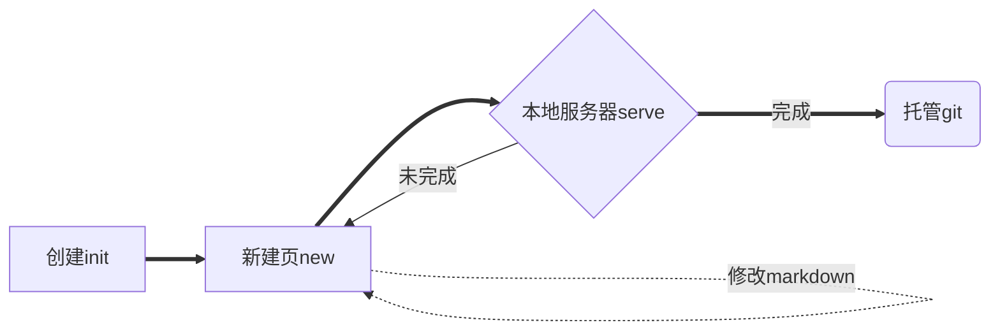

# Blog搭建指南 #笔记

## 一、基础命令

| 命令                       | 作用         |
| -------------------------- | ------------ |
| `modulename init packname` | 初始化包     |
| `modulename new pagename`  | `cd`更换环境后新建页       |
| `modulename generate`      | 刷新         |
| `modulename serve`         | 初始化服务器 |

## 二、常用模组

1. 单页：docsify
2. 多页：hexo

