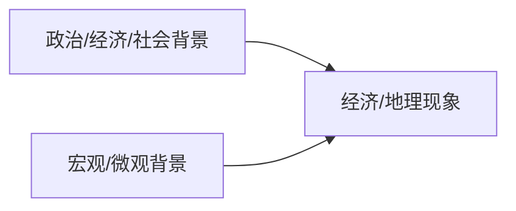
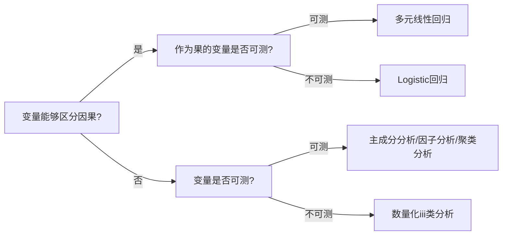

# 语文描述要点

## 一、答题技巧

1. 说明文

   1. 类型：实物说明文、事理说明文、程序说明文
   2. 顺序：时间顺序、空间顺序、逻辑顺序
   3. 方法：列数字、作比较、举例子、打比方、分类别

2. 阅读技巧

   1. 马原：局部理解-原理

      1. 理解认识类
      2. 结合类

   2. 马中化：广阔框架-事实

      1. 定义
         1. 内涵类
         2. 内容类
         3. 关系类
      2. 来源：时间宏/微、空间宏/微、理论/实践、政治/经济/文化角度
         1. 原因类
         2. 必然性类
         3. 依据类
         4. 条件类
      3. 去路
         1. 意义/价值/历史地位类
         2. 措施/路径/要求类

