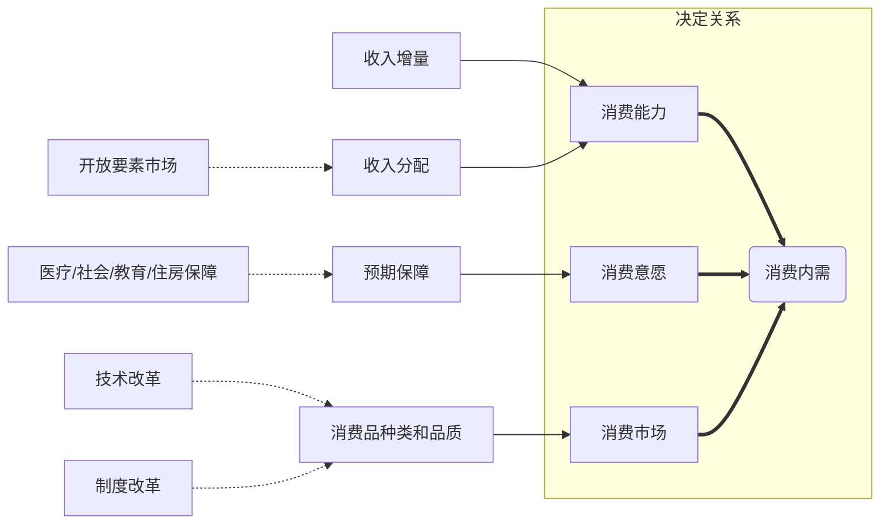

# 图片范本

```mermaid
flowchart LR
消费能力==>A(消费内需)
    收入增量-->消费能力
    开放要素市场-.->收入分配-->消费能力
消费意愿==>A
    医疗/社会/教育/住房保障-.->预期保障-->消费意愿
消费市场==>A
    B[消费品种类和品质]-->消费市场
    技术改革-.->B
    制度改革-.->B
subgraph 决定关系
    消费能力
    消费意愿
    消费市场
    A
end
```
