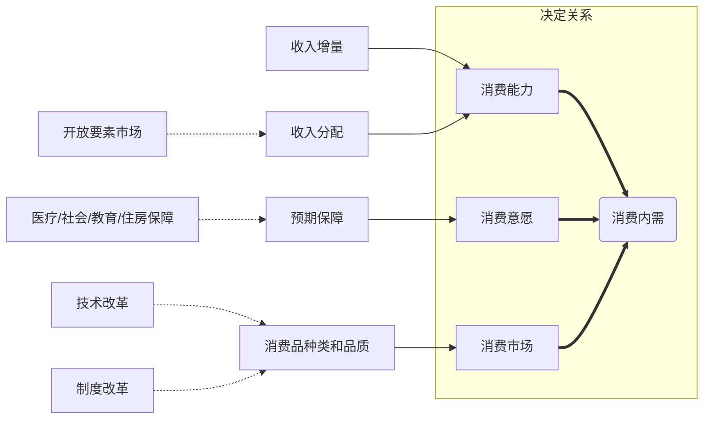
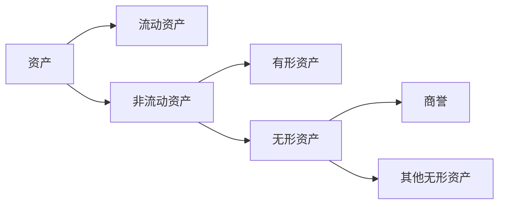
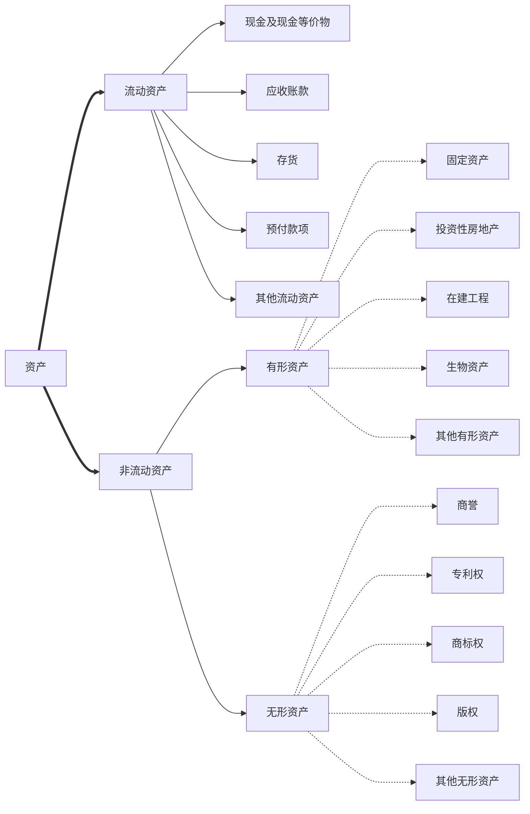

# 图片范本

```mermaid
flowchart LR
消费能力==>A(消费内需)
    收入增量-->消费能力
    开放要素市场-.->收入分配-->消费能力
消费意愿==>A
    医疗/社会/教育/住房保障-.->预期保障-->消费意愿
消费市场==>A
    B[消费品种类和品质]-->消费市场
    技术改革-.->B
    制度改革-.->B
subgraph 决定关系
    消费能力
    消费意愿
    消费市场
    A
end
```

---

```mermaid
graph LR
A[资产] --> B[流动资产]
A --> C[非流动资产]
C --> D[有形资产]
C --> E[无形资产]
E --> F[商誉]
E --> G[其他无形资产]
```

---

```mermaid
graph LR
A[资产] ==> B[流动资产]
A ==> C[非流动资产]
B --> D[现金及现金等价物]
B --> E[应收账款]
B --> F[存货]
B --> G[预付款项]
B --> H[其他流动资产]
C --> I[有形资产]
C --> J[无形资产]
I -..-> K[固定资产]
I -..-> L[投资性房地产]
I -..-> M[在建工程]
I -..-> N[生物资产]
I -..-> O[其他有形资产]
J -..-> P[商誉]
J -..-> Q[专利权]
J -..-> R[商标权]
J -..-> S[版权]
J -..-> T[其他无形资产]
```
