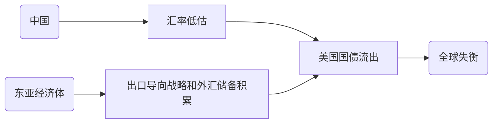
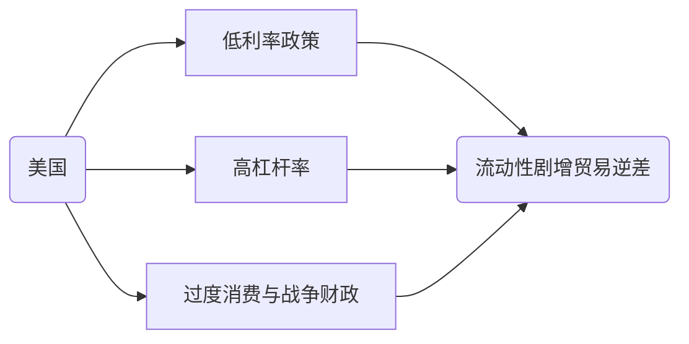

# 《从西潮到东风》#书籍

## 一、概论

### 1. 2008全球经济危机的形成因素

1. 全球失衡源自东亚和中国？

2. 东亚反驳
   1. `出口导向战略`已经实施半个世纪，但最近贸易顺差才大幅飙升
   2. 除美国外所有国家几乎都出现贸易顺差飙升

3. 中国反驳
   1. 中国在2005年后才出现巨额贸易顺差
   2. 双轨制-->高份额企业储蓄-->是高速发展和低消费率的原因

### 2. 走向复苏的共赢之路

1. 结构性改革的挑战
   1. 短期紧缩性：市场迭代-->经济增长放缓+失业人口增加
   2. 抵消方法：通过货币贬值刺激出口，
      1. 对非储备货币发行/无独立政策/无法公共货币债务化的国家不便实行
      2. 无对应自主权的南欧国家却又迫切需要结构性改革
2. 超越凯恩斯主义
   1. 理论：基础设施全面投资-->创造需求
   2. 实现：发达国家应当对发展中国家进行帮助

### 3. 落后国家如何实现追赶

> 雁行模式与领头龙模式

1. 中等收入陷阱
2. 发展理论的缺陷
3. 比较优势的工业化
